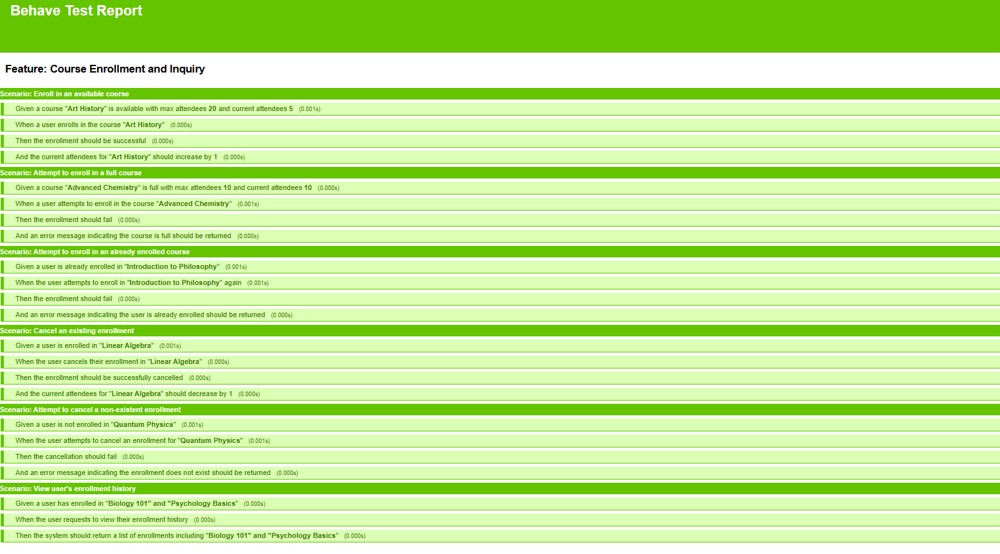
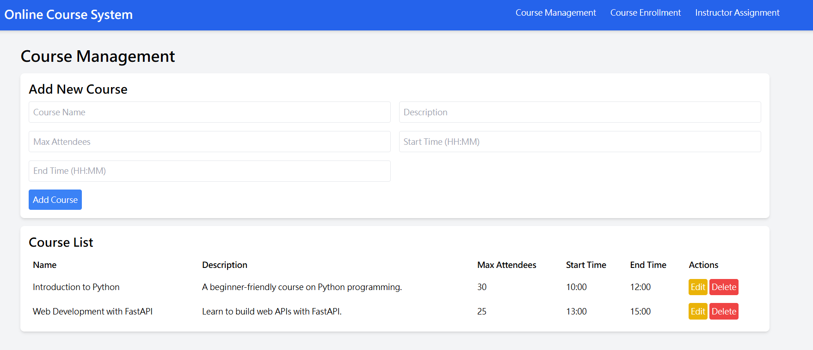

# 線上課程報名與管理系統

這是一個線上課程報名與管理系統的 Benchmark，用於 AI x BDD 研究。

## 設計理念

本系統旨在模擬一個簡易的線上課程報名與管理平台，包含以下核心功能：

- 課程管理
- 課程報名
- 講師分配與排程

## 功能列表

- **課程管理**：新增、修改、刪除、查詢課程
- **課程報名與取消**：學生可報名與取消課程
- **講師分配與排程**：管理講師分配與課程排程

## 執行 BDD 測試

在根目錄執行以下命令來執行 BDD 測試：

```bash
behave 後端/features -f behave_html_formatter:HTMLFormatter -o report/report.html
```



## 實際使用
啟動後端服務
在後端資料夾執行以下命令啟動 API 伺服器：

```bash
python app/api_server.py
```

啟動前端服務
切換到前端資料夾並啟動靜態文件伺服器：

```bash
cd 前端
python -m http.server 5000
```

## 訪問系統
打開瀏覽器，訪問 127.0.0.1:5000，您將看到主頁 


